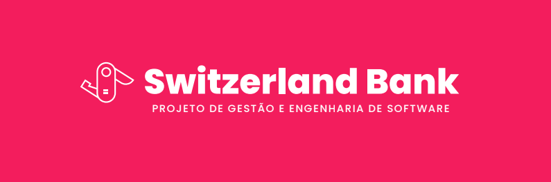

# Switzerland Bank - REST API

Switzerland Bank is a simulation of a digital bank developed with Spring Boot and Java. The project offers a solution to make payments through PIX, manage customer profiles, view the statement, and request credit and debit cards. With Switzerland Bank, users can enjoy a modern and efficient banking experience.

The project was developed as part of the disciplines of *Software Management and Quality* and *Models, Methods and Techniques of Software Engineering*, of the *Computer Science* course. The objective of the project was to take any open source project and refactor it, including (if necessary) GRASP and SOLID principles, and Design Patterns; in addition, perform unit and integration tests, and ensure at least 80% code coverage.

The URL of Switzerland Banl before the refactorings and tests: https://github.com/kauassilva/Switzerland_Bank

 

## Technologies

- Java 17
- Spring Boot 3.1.5
  - Spring Boot Starter Data JPA
  - Spring Boot Starter Web
  - H2
  - Spring Boot Starter Validation
  - Spring Boot Starter Test

 

## Refactorings

A major refactoring done was to separate the web pages from the API so that the API would return JSON, instead of, a HTML page.

### GRASP principles used

- **Controller** - Assigns the responsibility of handling system events to a class that represents a global use case scenario of the system.
- **Low Coupling** - Determines that classes should not depend on concrete objects but on abstractions, to allow for changes without impact.
- **Information Expert** - Determines when we should delegate responsibility to another object that is an expert in that domain.
- **High Cohesion** - This principle determines that classes should focus only on their responsibility.

### SOLID principles used

- **Single Responsibility Principle** - Determines that a class should have one, and only one, reason to change.
- **Open-Closed Principle** - Determines that objects or entities should be open for extension, but closed for modification.
- **Dependency Inversion Principle** - Determines that depend on abstractions and not on implementations.

 

## Tests

Unit and integration tests were performed on the controller, service and repositories layers. This totaled **186** tests, and a coverage of **93.1%** of the code.

186 Tests
:---:

Coverage of 93.1%
:---:

 

## Team

 |  |  | 
:---: | :---: | :---: | :---:
[Amanda Meneghini](https://github.com/AmandaMeneghini) | [Breno Luiz](https://github.com/BrenoLuiz19) | [Jullia Kathelyn](https://github.com/julliakathelyn) | [Kauã dos Santos](https://github.com/kauassilva)
